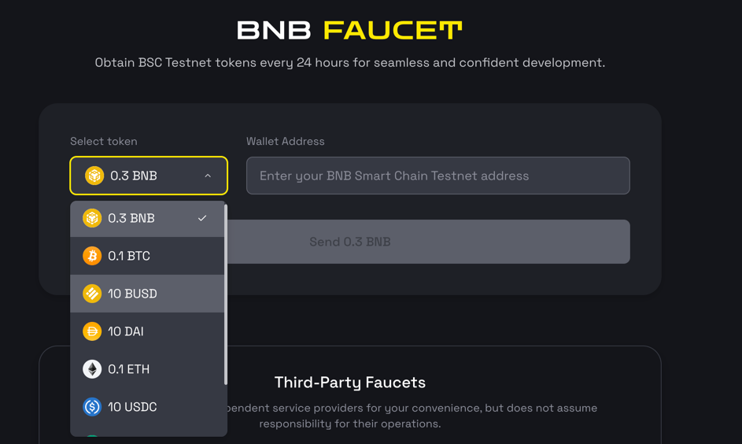

# Megafuel client Example

This repository hosts a collection of examples implemented in both Golang and JavaScript for the [Megafuel Paymaster](https://docs.nodereal.io/docs/megafuel-overview).
The client implementation follows the API standards of [BEP-414](https://github.com/bnb-chain/BEPs/blob/master/BEPs/BEP-414.md).
The examples include:

- Wallet integration: The wallet can detect transactions eligible for sponsorship through MegaFuel's API, 
and send these sponsorship-eligible transactions via the paymaster. As the solution is permissionless, any wallets are welcome
to integrate.
- Centralized Exchange (CEX) integration: Token issuers promote the adoption of their tokens by sponsoring CEX users 
to withdraw funds with zero gas fees. The CEX then manages this sponsorship policy through MegaFuel's interface.
- Payment gateway integration: The payment gateway sponsors consumers to pay with ERC20 tokens without incurring gas 
fees, using MegaFuel to manage the sponsorship policy.

## Network Endpoint

- BSC mainet: https://bsc-megafuel.nodereal.io
- BSC testnet: https://bsc-megafuel-testnet.nodereal.io

## Quick Start

Please get ERC20 token for test before you start:
1. Visit Faucet: https://www.bnbchain.org/en/testnet-faucet
2. Claim any kind of ERC20 token except BNB.

3. Follow the detailed instructions to run examples:

- [For wallet integration](./wallet-user/readme.md)
- [For payment gateway integration](./payment-gateway/readme.md)
- [For Cex integration](./cex/readme.md)

## More Docs about the Megafuel Paymaster
- [Paymaster Overview](https://docs.nodereal.io/docs/megafuel-overview)
- [Sponsor Policy Management](https://docs.nodereal.io/docs/megafuel-policy-management)
- [Sponsor Guidelines](https://docs.nodereal.io/docs/megafuel-sponsor-guidelines)
- [Wallet Integration Guide](https://docs.nodereal.io/docs/wallet-integration)
- [Paymaster API Spec](https://docs.nodereal.io/docs/megafuel-api)